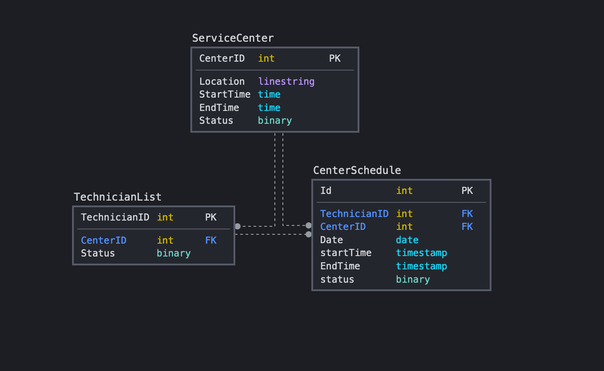
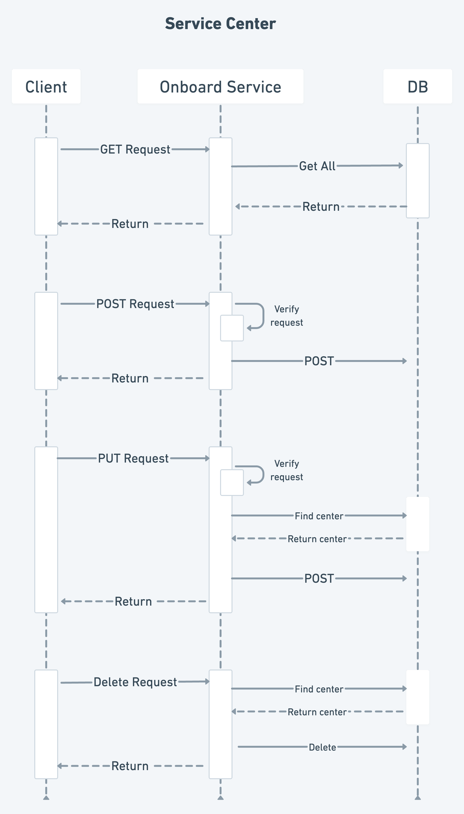

<div align="center">
<h1>
  User schedule management service
  <br>
  </h1>
</div>

<div align="center">
<h4 align="center">A system to maintain working hours of various service centers, mapping of technicians to service centers and working hours of each technician every week.</h4>
</div>


## Key Features

* On-board's service centers with working days, hours for each week.
* On-board's technicians for each service center.
* Assign's working hours of each technician every week.
* Given a time slot and service center, the system will be able to give list of all available technicians.

## Database Schema



## Flow



## Download

You can [download](https://gitlab.corp.olacabs.com/prajwal.r2/servicemanagementapi) the latest installable version of
Service Management API.

## POSTMAN COLLECTION

[Postman Collection](https://www.getpostman.com/collections/ed12bcbaf06156cc5e04)

## How To Initialize the project

To clone and run this application, you'll need [Git](https://git-scm.com)
and [Springboot](https://spring.io/projects/spring-boot) installed on your computer. From your command line:

```bash
# Clone this repository
$ git clone https://gitlab.corp.olacabs.com/prajwal.r2/servicemanagementapi.git

# Go into the repository
$ cd servicemanagementapi

# Run the app
$ spring run src/main/java/com/serviceManagementAPI/ServiceManagementApiApplication.java 
```

Note: If you're using Command Line for Windows to run the Spring
Boot, [see this guide](https://www.javaguides.net/2019/05/run-spring-boot-app-from-command-line.html).

## How To Use the API

### 1. On board service center

#### Request :

```bash
curl --location --request POST 'http://localhost:8080/v1/onboardCenter' \
--data-raw '{
"centerId":10,
"location":"Bangalore",
"startTime": "08:00:00",
"stopTime":"20:00:00",
"status":true
}'   
```

#### Response :

```bash
{
    "centerId": 10,
    "location": "Bangalore",
    "startTime": "08:00:00",
    "stopTime": "20:00:00",
    "status": true
}
```

### 2. On board Technician

#### Request :

```bash
curl --location --request POST 'http://localhost:8080/v1/onboardTechnician' \
--data-raw '{
    "technicianId": 2,
    "centerId": 2,
    "status": true
}'   
```

#### Response :

```bash
{
    "technicianId": 2,
    "centerId": 2,
    "status": true
}
```

### 3. Assign working hours to technician

#### Request :

```bash
curl --location --request POST 'http://localhost:8080/v1/assignTechnician' \
--data-raw '{
    "technicianId": 10,
    "centerId": 10,
    "date": "2021-05-02",
    "startTime": "11:00:00",
    "endTime": "20:00:00",
    "status": true
}'
```

#### Response :

```bash
{
    "id": 4,
    "technicianId": 10,
    "centerId": 10,
    "date": "2021-05-02T00:00:00.000+00:00",
    "startTime": "11:00:00",
    "endTime": "20:00:00",
    "status": true
}
```

### 4. Search technicians and service centers

#### Request :

```bash
curl --location --request GET 'http://localhost:8080/v1/searchTechnician' \
--data-raw '{
    "centerId": 10,
    "startTime": "11:00:00",
    "date": "2021-05-02"
}'
```

#### Response :

```bash
[
    {
        "id": 1,
        "technicianId": 10,
        "centerId": 10,
        "date": "2021-05-02",
        "startTime": "11:00:00",
        "endTime": "19:00:00",
        "status": true,
        "center": true
    }
]
```

## Credits

This software uses the following open source packages:

- [Spring Boot](https://spring.io/projects/spring-boot)
- [Spring Initializer](https://start.spring.io/)
- [Spring Data JPA](https://spring.io/projects/spring-data-jpa)
- [MySQL](https://www.mysql.com/)


